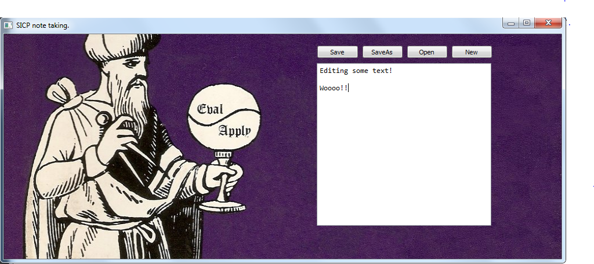

#SICPWriter

I am reading through SICP currently, but I realized my current editor that I was using to take notes wasn't good enough.
So I made my own SICPWriter.

### Requirements.

Runs using PyQt4, and was made using the Qt designer.

